# :clipboard: Table of Contents

* [Purpose](#purpose)
* [Prerequisites](#prerequisites)
* [Instructions](#instructions)
    * [Creating the Repository](#creating-the-repository)
    * [Editing with Visual Studio Code (VSCode)](#editing-with-visual-studio-code-vscode)
    * [Making our First Page](#making-our-first-page)
    * [Adding More Pages](#adding-more-pages)
* [Further resources/readings](#further-resourcereadings)
    * [Getting Started](#getting-started)
    * [Website](#website)
    * [Terminal](#terminal) 
* [Frequently Asked Questions (FAQ)](#faq)
* [Credits](#credits)

# :point_up: Purpose

The purpose of this README is to showcase how easy it is to use a static site generator. The goal of this tutorial is to cater to those who have never hosted a website before and wants to start. I will go through the steps on how you too can host a website like [this one](https://kayerm.github.io/). 

# :triangular_flag_on_post: Prerequisites

1. **Log in or Create an account with GitHub**. Make sure the username you pick or log in with is what you want your website to be. 

2. **Download [Visual Studio Code](https://code.visualstudio.com/)**. 

3. **Install [Git](https://git-scm.com/install/windows)**. 

4. **Download [Ruby](https://rubyinstaller.org/downloads/)**. When you open the link, it should be ready to download `Ruby+Devkit 3.4.8-1 (x64)`.

5. Download Bundler and Jekyll by opening a **Command Prompt** and typing in `gem install jekyll bundler`. This download may take a while.

# :memo: Instructions

## Creating the Repository

1. Click the **"+"** and select **New Repository** located at the upper-right side of your main GitHub page. 

2. Input `[username].github.io` under **Repository Name**.
    * `username` should be what your username is on GitHub. For instance, my username is `kayerm`, therefore my Repository Name is `kayerm.github.io`.

3. Turn **On** the **Add README**.

    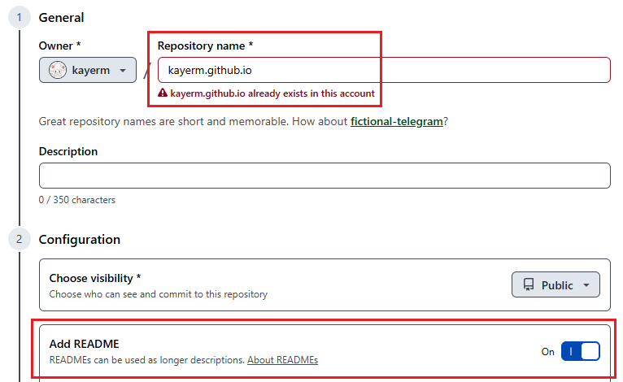

    **NOTE**: _Since my website already exists after making this tutorial, `kayerm.github.io` is already made and taken by me. However, if it's your first time making your website, it should say "**`username.github.io` is available**."_

4. Click **Create respository**. You should now see a page similar to the page below. I will refer to this page as your "_Repository_."

    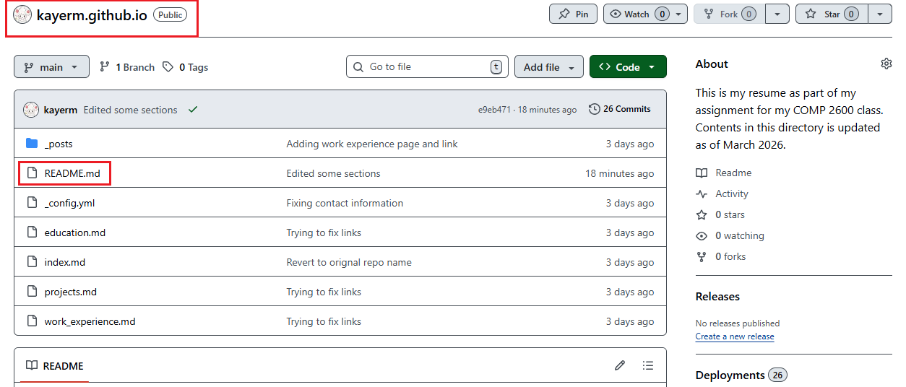

    **NOTE**: _Only difference is that you should only have a `README.md`. We will make these files later on._

5. Click on **Settings**.

    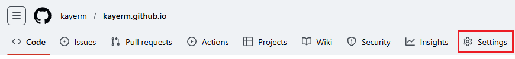

6. Look for the **Code and automation** section, and click on the **Pages** tab. 

7. Change the option to **Deploy from a branch** under **Source**.

8. Change the option to **None** under **Branch**.

    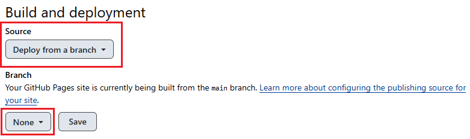

## Editing with Visual Studio Code (VSCode)

1. Open **Visual Studio Code**.

2. Click on **File**. 

3. Select **Open Folder**.

4. Select the folder you want to download your repository in.

5. Click **Select folder**. 

6. Click on **Terminal**

7. Click on **New Terminal**. A new tab should open under your _VSCode_. 

    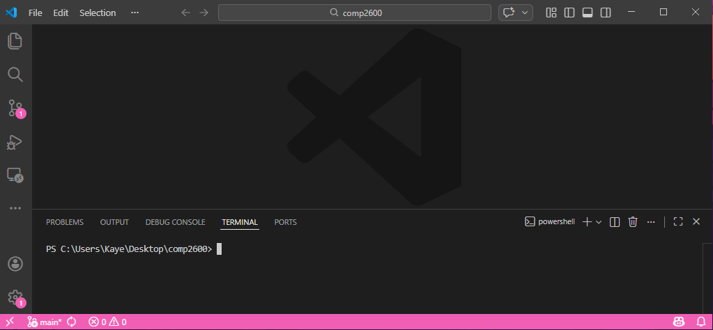

8. In your _repository_, click on the dropdown named **Code**. 

9. Copy the link.

    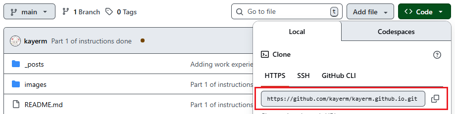

10. In your _terminal_, copy the following code below.

    ```
    git clone https://github.com/username/username.github.io.git
    ```

    **NOTE**: If there is an error associated with Git, Git was not properly installed. Refer to [prerequisites](#prerequisites).

11. Copy the following code below to go into that directory.

    ```
    cd .\username.github.io\
    ```

12. Type the following code below to create a new Jekyll site in the repository. 

    ```
    jekyll new --skip-bundle .
    ```

13. Open `Gemfile` in your directory. 

14. Make the changes in the following line numbers.

    ```
    10  # gem "jekyll", "~> 4.4.1"
    12  # gem "minima", "~> 2.5"
    15  gem "github-pages", group: :jekyll_plugins
    ```

15. Open `.gitignore` in your directory.

16. Add the line `Gemfile.lock` inside `.gitignore`.

## Making our First Page

1. In your _VSCode_, open the file named `_config.yml`.

2. Edit the following file based on information you know about your website. This is what I have.

    ```
    title: Kaye Mendoza's Resume
    email: mendozaruwe@yahoo.com
    baseurl: ""
    url: "https://kayerm.github.io"
    github_username: kayerm

    # I had to change "theme" to "remote-theme"
    remote_theme: pages-themes/hacker@v0.2.0 
    plugins:
        - jekyll-remote-theme
    ```

    **NOTE**: _A list of themes is provided in the [further resources/readings](#further-resourcereadings) section._

3. Open the file named `index.markdown` or `index.md` to edit our first page.

4. Change the head to the one below inside `index.md`. 

    ```
    ---
    layout: default
    title: "Main page"
    permalink: "/"
    ---
    ```

    * _Layout_ being _default_ means that we will let our chosen theme be our layout in our main page. 
    * _Title_ will be what is shown on your tab of where you are. 

        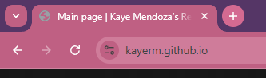

    * _Permalink_ will be where the page is located. `/` means that this page will be seen in `https://kayerm.github.io/`, which is the landing page of your website.

5. Add whatever you'd like under the header of `index.md`. As seem below, I added headers and hyperlinks to organize my data.

    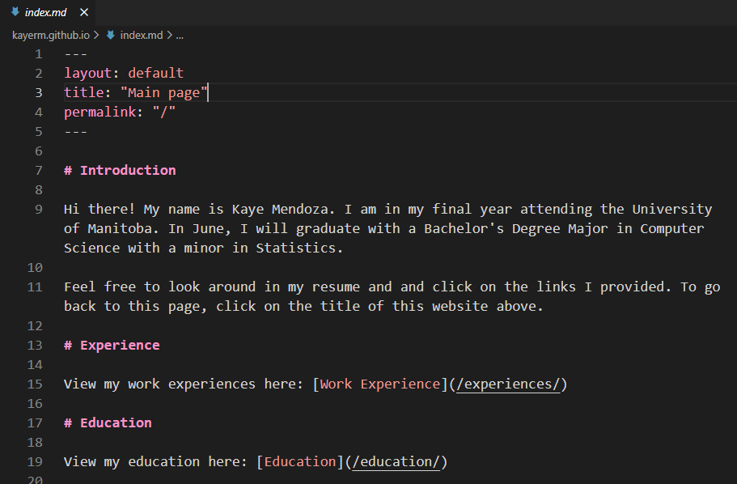

    **NOTE**: _Read more about Markdown in [further resource/readings](#further-resourcereadings) section._

6. Check if your terminal is in the appropriate directory. This should be `PS [filepath]\username.github.io>`.

    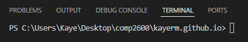

7. Type the following commands onto the terminal line-by-line to push our edits onto our GitHub repository. 

    ```
    git add .
    git commit -m "Making our first page"
    git push origin main
    ```

8. Go to your repository and wait until a check mark becomes present. You can do this by refreshing the page. GitHub is just making sure their checks go through. 

    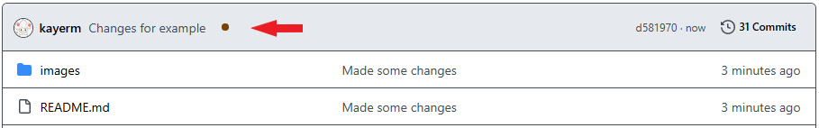

    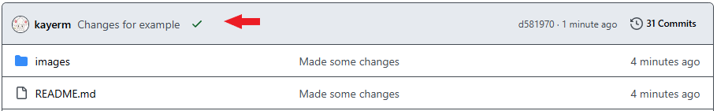

9. Type in your website in your web browser, `username.github.io` once you see the green check mark. 

    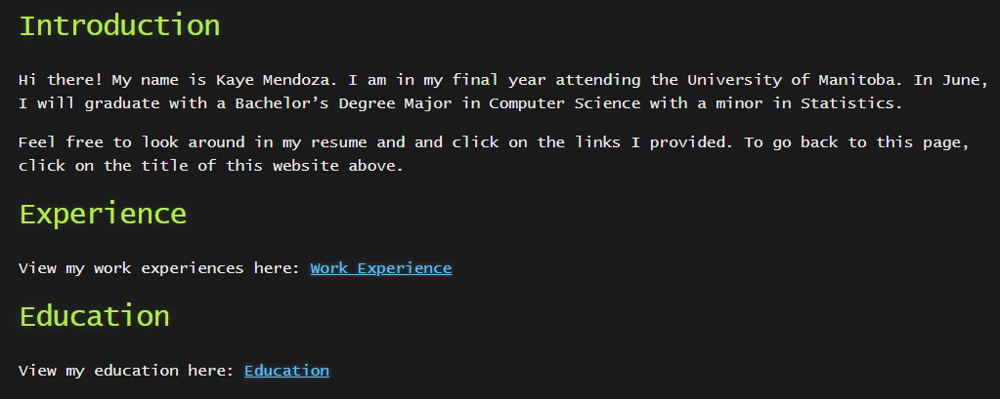

## Adding More Pages

1. Add another Markdown file (`filename.md`) inside your GitHub repository directory in _VSCode_.

2. Open the file, start it off with the header. 

    ```
    ---
    layout: default
    title: "Projects"
    permalink: /projects/
    ---
    ```

    If you can recall, 

    * The _title_ will be what shows up on the tab.

        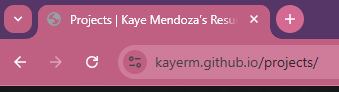

    * The _permalink_ will be where that page be located. In this scenario, we want the projects information to be different from the Main page. However, it is important that there is a way for you to get to `/projects/` from your `/` page or else your audience will not know this exists. 

3. Push your changes into your repository by typing the following into your directory again. 

    ```
    git add .
    git commit -m "Making our second page"
    git push origin main
    ```

4. Go to your repository and wait for the green check mark to show up. 

# :speech_balloon: FAQ

## Getting Started

* **Question**: No matter how much I try to undertstand [Creating the Repository](#creating-the-repository) and [Editing with Visual Studio Code (VSCode)](#editing-with-visual-studio-code-vscode) sections, I am still so lost. What can I do?

    * **Answer**: Sorry about that! I tried my best to break it down but [GitHub Pages tutorial](https://docs.github.com/en/pages/quickstart) may be helpful. 

## Website

* **Question**: Why is my website not working? 

    * **Answer**: When you push your changes into your GitHub repository, it can take a while to make the changes. Make sure that you are waiting until you see a _green_ check mark before you judge that your website is not working.

        

## Terminal

* **Question**: Why is Git asking for a username when I try to commit?

    * **Answer**: Git wants to know who is pushing the changes in the directory. To fix it, you have to introduce yourself first by typing in your username and email first, before your commit your changes.

        ```
        git config --global user.email "you@example.com"
        git config --global user.name "Your Name"
        git add .
        git commit -m "Commit message"
        git push origin main
        ```
        * `you@example.com` the email you created with GitHub
        * `Your Name` the username you created with GitHub

# :books: Further Resource/Readings

* View Markdown tutorials: **[Markdown tutorial](https://www.markdownguide.org/basic-syntax/)**
    * Everything you know about Markdown syntax and best practices when coding in Markdown. 

* View tutorials for Git: **[Git Tutorial with clone](https://earthdatascience.org/workshops/intro-version-control-git/basic-git-commands/)** and **[Git tutorial without clone](https://graphite.com/guides/git-add-commit-push)**
    * This will explain in detail what it means when we clone, pull, push, and commit code to our repository. 

* View more available themes: **[GitHub Page Themes](https://github.com/pages-themes)**
    * You can view what each theme looks like by clicking a theme you're interested in > Scrolling down to their README > find a hyperlink that says "_preview the theme to see what it looks like_."

* View examples of README: **[README examples](https://github.com/matiassingers/awesome-readme?tab=readme-ov-file)**
    * A README is very important to have in your GitHub respository. It explains what your website is about, how to check it out, and any comments you want to include but not on your website. 

# :cherry_blossom: Credits

Credit goes to: 

* Group 11 (Mateo DeSousa and Andrew Driver) of the COMP 2600 class of Winter 2026 for their critiques and conversation for the improvement of my website.
* The authors of [GitHub Pages tutorial](https://docs.github.com/en/pages/quickstart) that helped me get started. 
* The creator of the Jekyll Hacker theme, Jason Costello. 